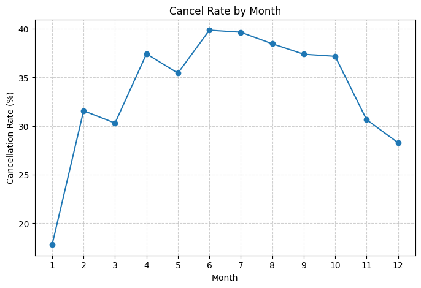
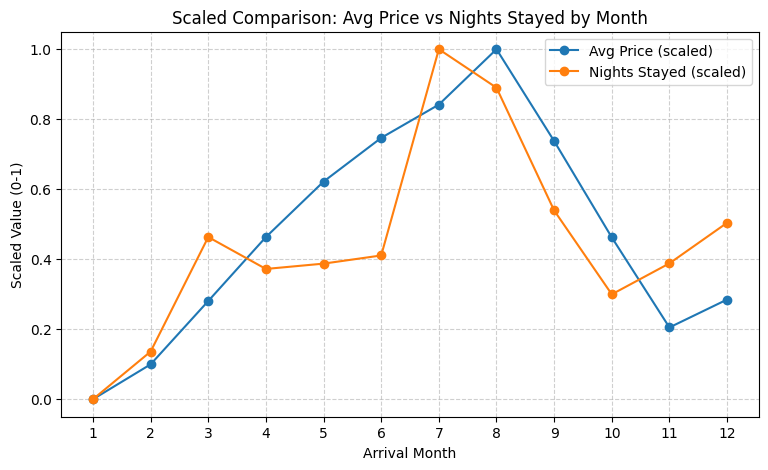
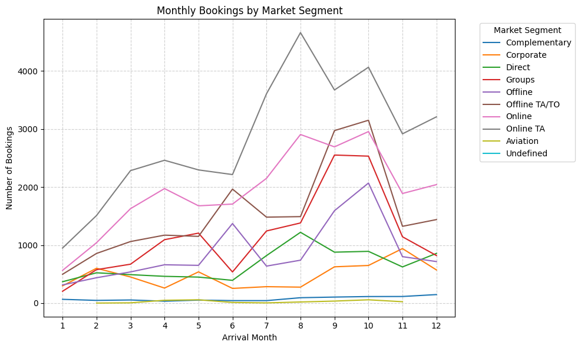
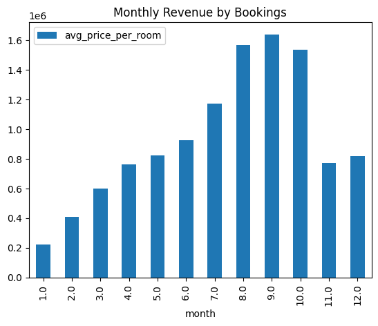

# Phase02 Report


### 1. Cancellation Rates for each month

We calculated the percentage of bookings canceled in each month by grouping on `arrival_month` and computing the mean of the binary `is_canceled` column. Higher percentages indicate months with heavier booking volatility.


```python

    cancel_rate_by_month = (
        #group data by arrival month
        df.groupby('arrival_month')['is_canceled']
        # sum up binary column and divide by number of samples
        .mean()
        # convert to percentage
        .mul(100)
        .reset_index(name='cancel_rate (%)')
        .sort_values('arrival_month')
    )

```


| arrival_month | cancel_rate (%) |
|----------------|-----------------|
| 1              | 17.811159       |
| 2              | 31.581769       |
| 3              | 30.311891       |
| 4              | 37.432631       |
| 5              | 35.450718       |
| 6              | 39.870512       |
| 7              | 39.657187       |
| 8              | 38.472385       |
| 9              | 37.396653       |
| 10             | 37.179098       |
| 11             | 30.662983       |
| 12             | 28.293031       |



Our data shows that rates spikes in summer months (June-August) and are lowest in January and December. 

### 2. Compute Average price and average number of nights for each month.


For each month, we computed:
- `avg_price_per_room` — mean daily booking revenue
- `nights_stayed` — total weekday + weekend nights

| arrival_month | avg_price_per_room | stayed_nights |
| ------------- | ------------------ | ------------- |
| 1             | 67.870616          | 2.738197      |
| 2             | 73.340136          | 2.877033      |
| 3             | 83.276551          | 3.210805      |
| 4             | 93.302379          | 3.117834      |
| 5             | 102.000425         | 3.133358      |
| 6             | 108.858464         | 3.157151      |
| 7             | 114.074734         | 3.758181      |
| 8             | 122.761549         | 3.645985      |
| 9             | 108.360909         | 3.288313      |
| 10            | 93.250079          | 3.043879      |
| 11            | 79.127639          | 3.134131      |
| 12            | 83.504243          | 3.252321      |




Prices and stay lengths both peak in July–August, which tracks with vacation season. When rooms cost more, guests stay longer 

### 3. Count monthly booking by market segment. 

We counted bookings by month and `market_segment_type` (Direct, Corporate, Groups, Online TA/TO, etc.).

- TA: Travel Agents
- TO: Tour Operators



Online channels dominate every month, especially toward the end of the year.

### 4. Identify the most popular month of the year for bookings based on revenue

Most popular month is September $1638308.59



## 2.2 Database Population

### Database Setup

The container was initialized with the following command:
```bash
docker run -d 
--name cs236_postgres 
-e POSTGRES_USER=postgres 
-e POSTGRES_PASSWORD=postgres 
-e POSTGRES_DB=hotel_bookings 
-p 5432:5432 
postgres:16
```
**Configuration Details:**
- **Container Name**: cs236_postgres
- **Database Name**: hotel_bookings
- **Port Mapping**: Host port 5432 → Container port 5432
- **Credentials**: postgres/postgres
- **PostgreSQL Version**: 16

---

### Schema Design

The schema was designed to support three distinct tables representing
1. The original hotel booking dataset (2015-2016)
2. The customer reservations dataset (2017-2018)
3. The unified merged dataset (2015-2018)

#### Table 1: hotel_data
```sql
CREATE TABLE hotel_data (
    id SERIAL PRIMARY KEY,
    email VARCHAR(255),
    country VARCHAR(100),
    hotel_type VARCHAR(100),
    arrival_year INTEGER,
    arrival_month INTEGER,
    arrival_week_number INTEGER,
    arrival_day INTEGER,
    arrival_date DATE,
    lead_time INTEGER,
    no_of_weekend_nights INTEGER,
    no_of_week_nights INTEGER,
    market_segment_type VARCHAR(100),
    avg_price_per_room DECIMAL(10, 2),
    is_canceled INTEGER
);
```

**Design Decisions:**
- `id SERIAL PRIMARY KEY`: Auto-incrementing integer for unique row identification
- `email VARCHAR(255)`: Standard email field length
- `arrival_date DATE`: Dedicated date field for temporal queries
- `avg_price_per_room DECIMAL(10, 2)`: Monetary values with 2 decimal places
- `is_canceled INTEGER`: Binary flag (0/1) for cancellation status

#### Table 2: customer_data
```sql
CREATE TABLE customer_data (
    id SERIAL PRIMARY KEY,
    booking_id VARCHAR(100) UNIQUE,
    arrival_year INTEGER,
    arrival_month INTEGER,
    arrival_day INTEGER,
    arrival_date DATE,
    lead_time INTEGER,
    no_of_weekend_nights INTEGER,
    no_of_week_nights INTEGER,
    market_segment_type VARCHAR(100),
    avg_price_per_room DECIMAL(10, 2),
    is_canceled INTEGER
);
```
**Design Decisions:**
- `booking_id VARCHAR(100) UNIQUE`: Business key with uniqueness constraint to prevent duplicate reservations
- Excludes hotel-specific fields (email, country, hotel_type, arrival_week_number) not present in this dataset
- Maintains consistent data types with hotel_data for common columns

#### Table 3: unified_data
```sql
CREATE TABLE unified_data (
    id SERIAL PRIMARY KEY,
    email VARCHAR(255),
    country VARCHAR(100),
    hotel_type VARCHAR(100),
    arrival_week_number INTEGER,
    booking_id VARCHAR(100),
    arrival_year INTEGER,
    arrival_month INTEGER,
    arrival_day INTEGER,
    arrival_date DATE,
    lead_time INTEGER,
    no_of_weekend_nights INTEGER,
    no_of_week_nights INTEGER,
    market_segment_type VARCHAR(100),
    avg_price_per_room DECIMAL(10, 2),
    is_canceled INTEGER
);
```

**Design Decisions:**
- Superset schema containing all columns from both datasets
- Fields may contain NULL values where data wasn't available in original sources
- `booking_id` not enforced as UNIQUE since merged data may contain duplicates across sources
- Comprehensive schema enables unified queries across both time periods

#### Index Strategy

Indexes were created on most likely to be frequently queried columns to optimize query performance:
```sql
-- hotel_data indexes
CREATE INDEX idx_hotel_arrival_date ON hotel_data(arrival_date);

-- customer_data indexes
CREATE INDEX idx_customer_arrival_date ON customer_data(arrival_date);
CREATE INDEX idx_customer_booking_id ON customer_data(booking_id);

-- unified_data indexes
CREATE INDEX idx_unified_arrival_date ON unified_data(arrival_date);
```

**Index Justification:**
- `arrival_date`: Supports temporal range queries and date based filtering
- `booking_id` (customer_data only): Accelerates lookup by reservation identifier

---

#### Implementation Steps

**Step 1: Spark Session Initialization**
```python
spark = SparkSession.builder \
    .appName("Hotel Bookings Database Population") \
    .config("spark.driver.memory", "4g") \
    .config("spark.sql.shuffle.partitions", "8") \
    .config("spark.driver.host", "localhost") \
    .config("spark.ui.enabled", "false") \
    .getOrCreate()
```

**Configuration Rationale:**
- `spark.driver.memory = 4g`: Allocated sufficient memory for large dataset processing
- `spark.sql.shuffle.partitions = 8`: Optimized parallelism for local execution
- `spark.ui.enabled = false`: Disabled UI to reduce overhead in batch processing

**Step 2: Load Cleaned Datasets from Phase 1**
```python
# Load Hotel Booking dataset
print("\nLoading hotel_df.csv...")
hotel_df = spark.read.csv(HOTEL_CSV, header=True, inferSchema=True)
hotel_count = hotel_df.count()
print(f"Hotel dataset loaded: {hotel_count:,} rows")

# Load Customer Reservations dataset
print("\nLoading customer_df.csv...")
customer_df = spark.read.csv(CUSTOMER_CSV, header=True, inferSchema=True)
customer_count = customer_df.count()
print(f"Customer dataset loaded: {customer_count:,} rows")

# Load Merged/Unified dataset
print("\nLoading merged_df.csv...")
merged_df = spark.read.csv(MERGED_CSV, header=True, inferSchema=True)
merged_count = merged_df.count()
print(f"Merged dataset loaded: {merged_count:,} rows")
```

**Decision**: Used `inferSchema=True` to automatically detect data types from CSV, reducing manual type conversion errors.

**Step 3: Data Preparation**
```python
# Drop the index column
if "_c0" in hotel_df.columns:
    hotel_df = hotel_df.drop("_c0")
    print("Dropped index column from hotel dataset")

if "_c0" in customer_df.columns:
    customer_df = customer_df.drop("_c0")
    print("Dropped index column from customer dataset")

if "_c0" in merged_df.columns:
    merged_df = merged_df.drop("_c0")
    print("Dropped index column from merged dataset")
```

**Rationale**: The `_c0` column is an artifact from CSV export (pandas index). Removing it ensures schema alignment with PostgreSQL tables.

**Step 4: JDBC Connection Setup**
```python
JDBC_URL = f"jdbc:postgresql://{POSTGRES_HOST}:{POSTGRES_PORT}/{POSTGRES_DB}"

jdbc_properties = {
    "user": POSTGRES_USER,
    "password": POSTGRES_PASSWORD,
    "driver": "org.postgresql.Driver"
}
```

**Connection Parameters:**
- **URL**: `jdbc:postgresql://localhost:5432/hotel_bookings`
- **Driver**: Official PostgreSQL JDBC driver ensures compatibility

**Step 5: Write to Database**
```python
print("\nWriting hotel_data table")
hotel_df.write \
    .mode("overwrite") \
    .jdbc(url=JDBC_URL, table="hotel_data", properties=jdbc_properties)
print(f"hotel_data table populated with {hotel_count:,} rows")
```
